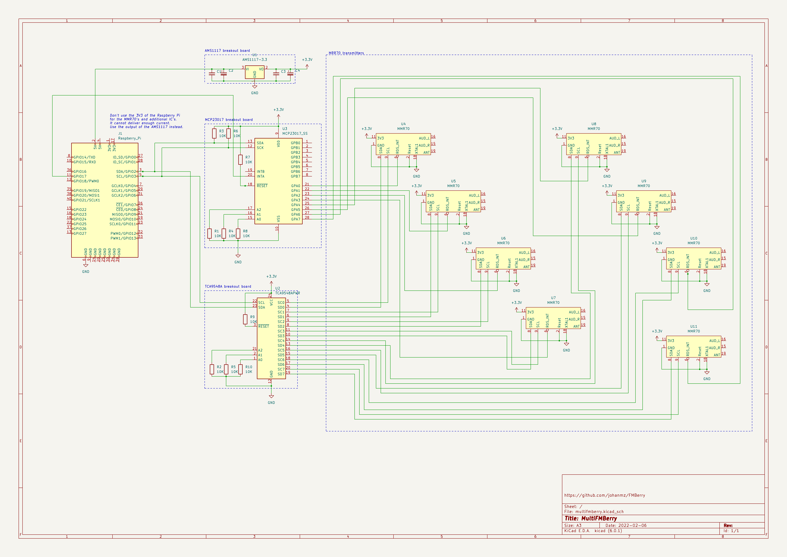

FMBerry - Hardware
=======

The following components are needed:
* one or more MMR70 transmitters
* one or more TCA9548A breakout boards. Each TCA9548A can handle up to 8 transmitters
* one ore more MCP23017 breakout boards. Each MCP23017 can handle up to 16 transmitters
* AMS1117 breakout board to convert the 5V of the Raspberry Pi to 3.3V. Each AMS1117 board should be able to handle up to 800mA. Each transmitter draws 27mA, the other IC's less.

Build your setup according to the schema below. If you want to use less transmitters, simply omit them.




Don't forget to disable the internal processor of the transmitter. This can be done easily by shorting on of it's crystal pins.
To do this connect TP18 to GND and TP2 to GND.
 
 Connect specific testpoints on the PCB of the MMR70 to the TCA9548A and MCP23017 IC's according to the schema. Also connect the 3.3V and GND.

Thanks to Oliver J. (skriptkiddy) for the schematics and the photo with all named testpoints.
Thanks to Andrey Chilikin for the excellent photo with all testpoints labeled.

[Schematic of the MMR-70](http://www.mikrocontroller.net/attachment/140251/MMR70.pdf)


External antenna, a wire (300/(frequency in MHz) * 25) cm long, can be connected to TP19 or to TP20 - the only testpoint on back side of MMR-70

Connect a sound cable with 3,5" jack to the audio input testpoints:

* Audio GND -- TP1
* Audio R   -- TP15
* Audio L   -- TP16

And plug it into a USB sound card.

Checking the transmitters
------------
The TCA9548A uses I²C port 0x70, the MCP23017 I²C port 0x20. Check with ``i2cdetect -y 1`` if your Raspberry Pi can see them.

```
pi@multifmberry:~ $ i2cdetect -y 1
     0  1  2  3  4  5  6  7  8  9  a  b  c  d  e  f
00:                         -- -- -- -- -- -- -- --
10: -- -- -- -- -- -- -- -- -- -- -- -- -- -- -- --
20: 20 -- -- -- -- -- -- -- -- -- -- -- -- -- -- --
30: -- -- -- -- -- -- -- -- -- -- -- -- -- -- -- --
40: -- -- -- -- -- -- -- -- -- -- -- -- -- -- -- --
50: -- -- -- -- -- -- -- -- -- -- -- -- -- -- -- --
60: -- -- -- -- -- -- -- -- -- -- -- -- -- -- -- --
70: 70 -- -- -- -- -- -- --
```
Switch the TCA9548A to transmitter 1 and check again. Now you should see also the MMR70 on I²C port 0x66:
```
pi@multifmberry:~ $ i2cset -y 1 0x70 1
pi@multifmberry:~ $ i2cdetect -y 1
     0  1  2  3  4  5  6  7  8  9  a  b  c  d  e  f
00:                         -- -- -- -- -- -- -- --
10: -- -- -- -- -- -- -- -- -- -- -- -- -- -- -- --
20: 20 -- -- -- -- -- -- -- -- -- -- -- -- -- -- --
30: -- -- -- -- -- -- -- -- -- -- -- -- -- -- -- --
40: -- -- -- -- -- -- -- -- -- -- -- -- -- -- -- --
50: -- -- -- -- -- -- -- -- -- -- -- -- -- -- -- --
60: -- -- -- -- -- -- 66 -- -- -- -- -- -- -- -- --
70: 70 -- -- -- -- -- -- --
```
This way you can check all tranmitters. Note that you have to send the bit corresponding to the port, so ``i2cset -y 1 0x70 2`` for transmitter 2, ``i2cset -y 1 0x70 4`` for transmitter 3, ``i2cset -y 1 0x70 8`` for transmitter 4, etc.


## Setup fmberry.conf

The software needs to know your hardware setup. Modify fmberry.conf according to your needs. The sample file matches the setup above.
For less then 8 transmitters, simpy delete the corresponding transmitter sections from the fmberry.conf file.

The config file can be found (after the make install) in /etc/fmberry.conf

That's it! 


## Common hardware problems

__Transmitters cannot be heard__

Check if /etc/fmberry.conf file is setup correctly. Check the IO expander section and in the Transmitter section the IO expander reference and the multiplexer port and adresses.

Check the hardware.

See ``Checking the transmitters`` section above.

Check the log file with ``ctlfmberry log`` for errors.


__The power supply of the raspberry pi shorts out/there are no lights anymore__

There is a short circuit. Probably caused by a wiring fault

__Transmitters work but no RDS__

Make sure the connections between the transmitter and the MCP23017 are setup correct. Also make sure the MCP23017 is connected to the Raspberry Pi according to the schema.

Make sure that your radio is close enough to the transmitter or connect an antenna wire to testpoint 19 of the tranmitters.

Check the IO expander section in /etc/fmberry.conf and check if the IO Expander port setting in the Transmitter sections match the correct IO expander section and port.

__The transmission dies after a couple of minutes__

You didn't disable the internal processor of the MMR70(s). Do this by connecting TP18 to GND.

## I want to connect more then 8 transmitters

__NOTE: I haven't tested this yet, it might or might not work__

The software is capable of handling more then 8 transmitters. 

__Additional hardware__
You'll need an additional TCA9548A if you want to connect more then 8 transmitters. The MCP23017 can handle 16 transmitters but for practical reasons you might also want to use a second MCP23017.
Each MCP23017 needs to be connected to a unique suitable GPIO pin on the Raspberry Pi. 

Give the additional TCA9548A and MCP23017 unique I²C adresses by connecting one or more A0/A1/A2 address selector lines to 3V3. 

Connect the SDA and SCL lines of the additional TCA9548A and MCP23017 with the Raspberry Pi (in parallel with the existing connections).

Be carefull that you don't exceed the max current of the AMS1117, use additonal AMS1117 breakout boards if you exceed the max current. Don't take risks, there are reports that some AMS1117 IC's from dubious chipmakers have no overcurrent protection and output 5V when overloaded.

__Update fmberry.conf__

Make sure that you add an IO Expander section with the corresponding unique I²C adress in the fmberry.conf file for each additional MCP23017

Add transmitter sections, give each transmitter section a unique name. Don't forget to use the correct TCA9548A adress and port in the transmitter sections and refer to the new IO expander section of the additional MCP23017.
